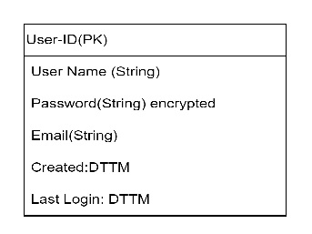
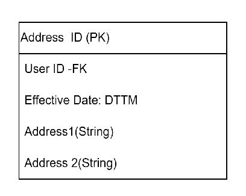
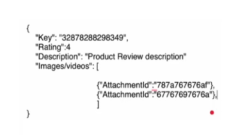
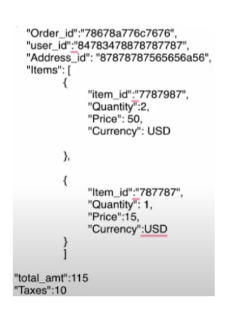
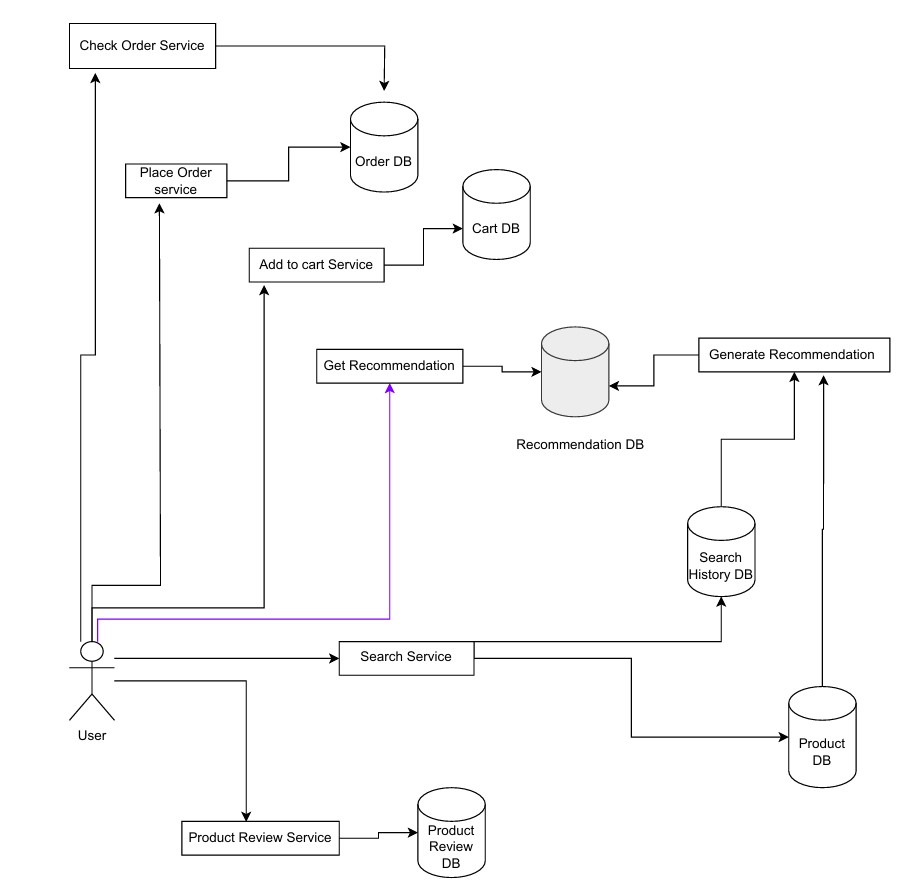
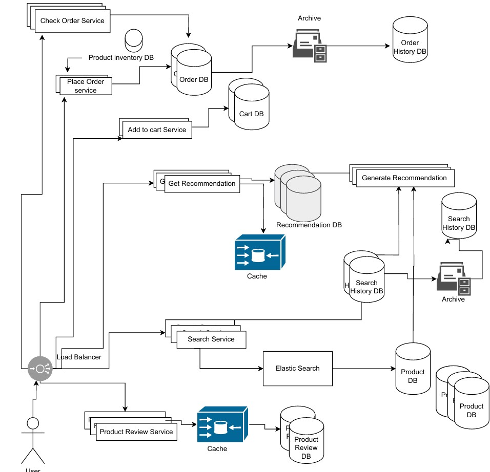

# MoodArts
## Problem Definition: E-Commerce website System Design
It is art store where users can buy arts (Paintings, Crafts, DIY kits) from different artist.

Assumption:
1. User authentication, profile creation is provided
2. Payment gateway provided

## Main Functional Requirements
1. User able to search product
2. Show recommended products
3. Place Order
4. Check status of order
5. Read write reviews for a product

## Non - Functional Requirements
1. Low-Latency (Recommendations and search)
2. High Consistency (Placing order, order status, payments)

## Capacity and Scale Estimation
Active Users: 10,000 /month
Each user search for 10 products
Search queries: 100,000 searches/month = 10^5 / (30 *10^5) = 2 users/min

**Storage estimates**:
Artist registered with us: 1000
Crafts persons: 300
DIY Kits sellers: 200
No. of products / vendor = 10
Products in catalogue:15,000 
1 product requires :10 MB (images+ description)
Total storage required: 150 GB


## Database Design 

1. User-DB (SQL) 
   


2. Address DB - SQL
   


3. Product Data: No-SQL Database(key-value pair)
```json
{
"id":"12345268"
"category":"painting"
"subcategory":"acrylic"
"size":"10*5"
"artist":"abcd"
}
{
"id":"2547869"
"category":"DIY Kit"
"item":"wall_hanging"
"type":"wood"
"size":"10"
"vendor":"MR.DIY"
}
```

1. Reviews Data: No-Sql DB
   


5. Order Table : No -SQL DB
   


APIs
1. GetRecommendations(UserID)/ DisplayList - Returns a list of product with 10 products in a page
2. Search(Search String, User ID) - return list of products
3. Add to Cart(UserID, ProductID, Qty) -  boolean return of status
4. PlaceOrder(UserID,OrderID, AddressID, PaymentStatus)  - returns boolean
5. CheckOrderStatus(OrderID) - Get - returns order status

## System Design Diagram when Low Load


## System Design Diagram when High Load 



